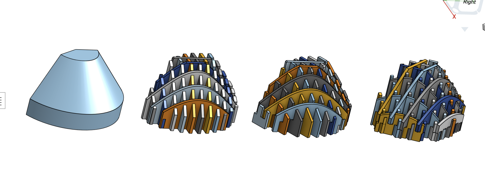

# Section Slicer — Onshape Custom Feature

A custom FeatureScript feature for Onshape that slices a solid body into interlocking sections with rectangular tab-and-slot joints, suitable for laser cutting or CNC flat-pack assembly.

## What it does

Given a solid 3D body, Section Slicer cuts it into uniformly-thick slices along one, two, or three axes and automatically adds rectangular slots so the sections interlock. Think of it like a cardboard model kit.

- **One-axis (X only):** Parallel slices along one direction.
- **Two-axis (X + U):** Cross-hatched slices. The U-axis skew angle is adjustable.
- **Three-axis (X + U + V):** Hexagonal pattern. The U/V skew angles are fixed at ±30°, and section spacing rules are enforced to prevent triple-intersection regions.

## Usage in a new Onshape project

Onshape custom features are tied to documents, not standalone files. There are two ways to bring this feature into a new project:

### Option 1 — Copy the original public document (recommended)

1. Open the original shared document by Anthony Lu in Onshape.
2. Click the document menu (top-left) → **Copy document** to fork it into your workspace.
3. In any Part Studio, the **Section Slicer** feature will appear in the custom feature toolbar, or you can add it via **Add custom feature** and point it at your copied document.

This is the simplest path and is what most users do.

### Option 2 — Set up from source (for developers)

The repo contains two FeatureScript files:

| File | Role |
|---|---|
| `SectionSlicerFeature.fs` | Feature definition, UI parameter declarations, entry point |
| `SectionSlicerMain.fs` | Core slicing and slot-cutting logic |

`SectionSlicerMain.fs` imports several helper files by their Onshape element IDs (the long hex paths in the `import` statements). These helpers live in the original Onshape document alongside the main files.

To recreate the full project from scratch:
1. Create a new Onshape document and add a FeatureScript tab for each `.fs` file.
2. Create FeatureScript tabs for each helper module referenced by the import paths in `SectionSlicerMain.fs`, copying their source from the original document.
3. Update the `import` paths in `SectionSlicerMain.fs` to use your new document's element IDs (found in the URL of each FeatureScript tab).
4. In `SectionSlicerFeature.fs`, update the `export import` path to point to your version of the helpers library.

## Feature parameters

| Parameter | Description |
|---|---|
| **Target** | The solid body to slice |
| **Keep Target** | Preserve the original body alongside the sections |
| **Section Width** | Thickness of each slice (default 10 mm) |
| **Section Space** | Gap between slices (default 10 mm) |
| **Reverse Slot Direction** | Flip whether X or U sections receive the upper vs. lower half of each slot |
| **Horizontal Plane** | Plane the sections are normal to (default: Top Plane) |
| **X-Axis Geometry Reference** | Optional direction reference for the X axis |
| **U-Axis / V-Axis** | Enable second and third cutting axes |

A **Debug View** group exposes overlays for the coordinate system, bounding box, section center points, and per-axis section bodies.

---

## Attribution

Recovered from a shared public Onshape project. Original header:

> **"Section Slicer" — Custom Feature**
> Anthony Lu — July 2022
>
> Slices a solid body into sections of uniform thickness with rectangular slots for fitting together. The orientation of sliced sections may be adjusted by selecting a coordinate system in the settings, and uses world coordinates by default. The slicer arranges its sections along their respective slicer axes, with its X-axis serving as the reference axis. In two-axis mode, the skew angle of the U-axis (angle with respect to the slicer Y-axis) is adjustable.
>
> In three-axis mode, the angles between X, U, V axes are fixed to produce a hexagonal pattern between their sections, and restrictions are enforced to avoid regions where sections of all three axes intersect. The U, V axes are fixed to skew angles of 30 deg and −30 deg, respectively. The section space must be greater than twice the section width to give V-axis sections enough clearance.
>
> The resulting sections are named and numbered according to their axis. The convention is to prefix position and direction vectors with lowercase letters `w` for world coordinates, and `l` for local (slicer) coordinates.
